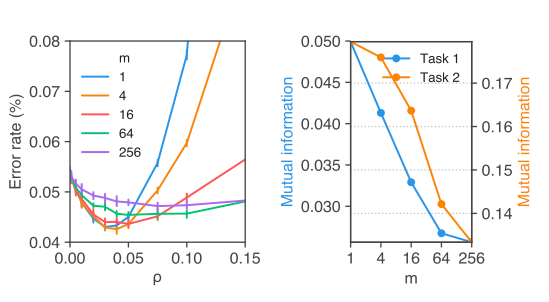

```{r setup, include=FALSE}
knitr::opts_chunk$set(echo = FALSE)
```

Sharness-Aware Minimization(`SAM`)@2020arXiv201001412F is a simple, yet interesting procedure that aims to minimize the loss and the loss sharpness using gradient descent by identifying a parameter-neighbourhood that has the same uniform loss. 

# Foundation
Given a training set $S$ sampled i.i.d from $D$, the following theorem states a bound for generalization in terms of neighbourhood training loss at weight $w$

$$
L_D(w) \leq max_{||\epsilon \leq \rho ||}L_S(w+\epsilon) + h(\frac{||w||_2^2}{\rho^2})
$$
Notice that the second term is equivalent to L2 normalization. Taking the first term:
$$
max_{||\epsilon \leq \rho ||}L_S(w + \epsilon) = [max_{||\epsilon \leq \rho ||}L_S(w + \epsilon) - L_S(w)] + L_S(w)
$$
The term $max_{||\epsilon \leq \rho ||}L_S(w + \epsilon) - L_S(w)$  is defined as sharpness at $w$. The training objective is now $L_{SAM}(w) + \lambda||w||_2^2$, where $L_{SAM}(w) = max_{||\epsilon \leq \rho ||}L_S(w+\epsilon)$. After taylor series to this equation and solving for $\epsilon = \epsilon(w)$, we arrive at: 
>$$
\epsilon(w) = \rho sign(\nabla_wL_S(w)) \frac{|\nabla_wL_S(w)|^{q-1}}{(||\nabla_wL_S(w)||_{q}^{q})^p},(q = \frac{p}{p-1}\,from\,Holder's \,inequality)
$$

Simply put, at $p = q = 2$, SAM is a two-step process: 1) Calculate the gradients(First backward pass) 2) Calculate $\epsilon(w)$ 3) Recaclulate gradients(Second backward pass). This means if if all the batches are used for training, each epoch involves calculating gradients twice, which can be expensive.

# M-Sharpness
The paper further defines `m-sharpness`: the idea behind which is if `m` subset of the training data batch is used to calculate the gradients in the first backward pass of the epoch. The diagram below from the paper illustrates the impact of m. The left chart indicates that at $m=4,16$ the generalization gap is lower and the right chart indicates the correlation of generalization gap and `m` which shows that lower values of m have higher correlation with the generalization gap.

```{r}
library(knitr)

```

# Code

This repository @sampytorch provides a clean implementation of SAM in PyTorch. We further extend this implementation to be able to wrap most optimizers. You can find the code at @tourdemlsam

```python
model = resnet18()
optim = torch.optim.SGD(model.parameters(), 1e-3)
optim = SAM(model.parameters(), optim)
def closure():
  optim.zero_grad()
  loss = model(torch.randn(1,3,64,64)).sum()
  loss.backward()
  return loss
optim.step(closure)
```
