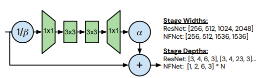

```{r setup, include=FALSE}
knitr::opts_chunk$set(echo = FALSE)
```

Adaptive Gradient Clipping introduced in the paper "High-Performance Large-Scale Image Recognition Without Normalization" from DeepMind by @agcbrock

# From GC to Adaptive GC

@gradientclippingpascanu first introduced the gradient clipping technique: for model parameters $\theta$ and loss function $L$, the gradient for a particular layer/group of weights($l$) $G^l$ is $G^l = \frac{\partial L}{\partial \theta^l}$. Now, Gradient clipping scales down the gradient based on it's norm.

$$
G^l \rightarrow \begin{cases} \lambda \frac{G^l}{\vert\vert G^l\vert\vert},& \text{if } \vert\vert G^l\vert\vert > \lambda\\
    G^l,              & \text{otherwise} \end{cases}
$$

Here, the gradient clipping is performed independent of the weights it affects, i.e it only dependent on $G$. @agcbrock suggests **Adaptive Gradient Clipping**: if by modifying the gradient clipping condition by introducing the Frobenius norm of the `weights`($W^l$)  the gradient is updating and the gradient $G^l$ for each block $i$ in $\theta$ parameters:

$$
G_i^l \rightarrow \begin{cases} \lambda\frac{\vert\vert W_i^l\vert\vert_F^*}{\vert\vert G_i^l\vert\vert_F},& \text{if } \frac{\vert\vert G_i^l\vert\vert_F}{\vert\vert W_i^l\vert\vert_F^*} > \lambda \\ G_i^l,& \text{otherwise }  \end{cases}
\\
where \hspace{1mm} {\vert\vert W_i^l\vert\vert_F^*} = max({\vert\vert W_i^l\vert\vert_F^*}, \epsilon)
$$

Notice that the condition that regulates the gradient norm depends on the norm with respect to the block of weights its being used to update. So if the weight norm is much higher than the gradient norm or if the gradient norm is too small with respect to the weight norm, the clipping suggests to scale the gradient down. This property makes the clipping *adaptive*.

You might find yourself now wondering, *"This is cool, but this doesn't solve the normalization of features that BatchNorm provides, so where's that?"*. Here, the second trick adapted from a previous paper by the first author @weightstandardizationbrock that introduces - **Weight Standardization** and **Activation scaling**

$$
\text{Weight standardization: } \hat W_{ij}= \frac{W_{ij} - \mu_i}{\sqrt N \sigma_i}
$$

where $(mean)\mu = (1/N) \sum_j W_{ij}$, $(variance) \sigma_i^2 = (1/N)\sum_j (W_{ij} - \mu)^2$ and $N$ is fan-in i.e number of input units. In *activation scaling*, $\gamma$ is used to scale the activation outputs, where $\gamma = \sqrt{2/(1 - (1/\pi))}$ for ReLUs.

# Weighted Residual Connections 

Residual connections have traditionally been $h_{i+1} = h_i + f_i(h_i)$, where $h_i$ is input to the residual block $f_i$. In the NF family of networks, it is modified to $h_{i+1} = h_i + \alpha f_i(h_i/\beta_i)$. Intuitively, this translates to `learning to scale` the input and the output of the function inside the residual block, as opposed to setting it as identity.

These techniques are used in the NAS pipeline to discover the family of architectures the authors term as `NFNets`. Hence, all of the above techniques combined __eliminates the mean-shift__ - the central role of BatchNorm. This technique scales well with large training batch sizes. The PyTorch code is available on [GitHub](https://github.com/vballoli/nfnets-pytorch)

`https://github.com/vballoli/nfnets-pytorch`

```{r}
library(knitr)

```

<script src="https://utteranc.es/client.js"
        repo="tourdeml/comments"
        issue-term="og:title"
        label="comments"
        theme="github-light"
        crossorigin="anonymous"
        async>
</script>